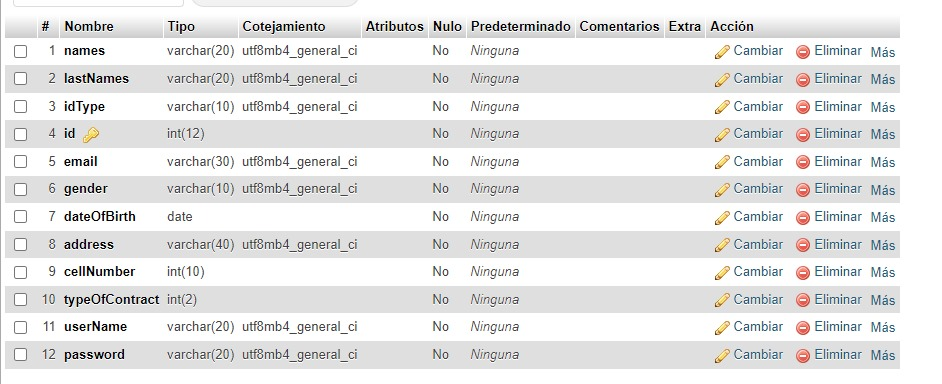
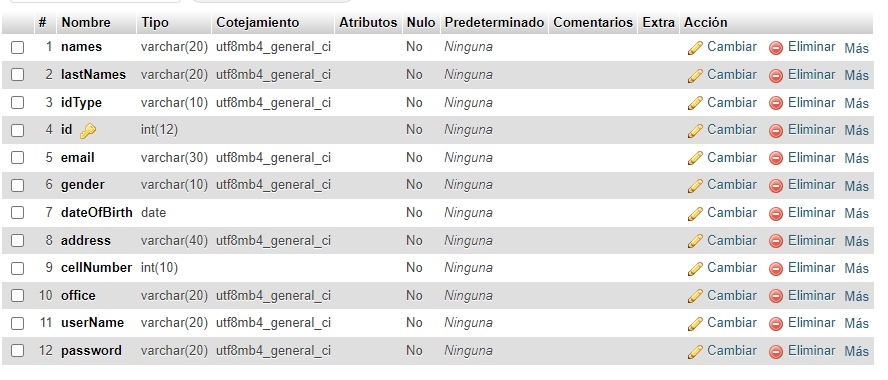
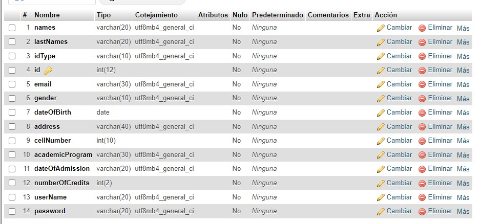
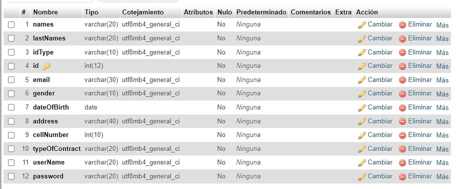
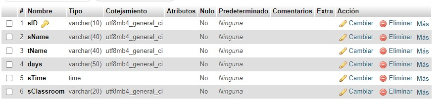

#TechnoEra
We create TechnoEra from an university asignation where we recreate our university's web site. The web has many roles and of course different access for all of them.

## Índice
1. [Introduction](#Introduction)
2. [Parameters](#Parameters)
3. [Pre-Installation Steps](#Pre-Installation-steps)
4. [Installation Steps](#Instalation-steps)
5. [Process](#Process)
   - [Built with](#Building)
6. [Authors](#Autors)

## Introduction
TechnoEra was created by Luna Garcia and Sara Murillo, it started from an university asignment and it's similar to our university web site, you can enter as Student, Manager, Administrative or Teacher and based on your rol you'll have a different Landing with different buttons ans functions.

## Parameters
- Rol management
- User profile
- Academic management
- User register
- Profile management
- Subject scores
- Data base
- Graphic User Interface

## Pre-Installation Steps
As a pre-parameter you'll have to install some programs such as:
   - XAMPP
   - Visual Studio Code (Specifically)
     - HTML
     - CSS
     - JavaScript
   - NodeJS

## Instalation Steps
1. Open a terminal on Visual Studio
2. Use the command "git init"
3. Use the command "git remote add origin https://github.com/SaraMur-poli/TechnoEra.git"
4. Use the command "git clone https://github.com/SaraMur-poli/TechnoEra.git"
5. Open XAMPP and start Apache and MySQL 
6. Click on button Admin on MySQL, this will open a web where you'll create the data base
7. On this web, click on the left part where it says "Nueva"
8. On the name of the data base put "technoera"
9. Click on the "Crear" button
10. On the left part you'll see the name of the DB, click on it and create a table
11. Tables should look like this:
    - 
    - 
    - 
    - 
    - 
12. Go to visual again and on the terminal:
    - If you want to login use "node ./Script/app.js"
    - If you want to create an user, based on the roll you'll use:
       - "./Script/registerAdmins" to create an Admin
       - "./Script/registerManagers" to create a Manager
       - "./Script/registerStudents" to create a Student
       - "./Script/registerTeachers" to create a Teacher
    - To create a subject use: "./Script/subjects"
13. Open the login.html file
14. On the bottom part of Visual click on "go live" and use "Admin1" and "12345678" to enter as an Admin and there you'll be able to navigate

## Process
Our web was created in about 1 month and a half, we used git as our version control software. Worked separately and in different branches dividing our work equally. Overall, it was a great process, we learned a lot.

### Built with
We built the web using HTML, CSS and JS. We used Visual as our workspace and git to control changes of the web

## Authors
Luna Garcia and Sara Murillo
